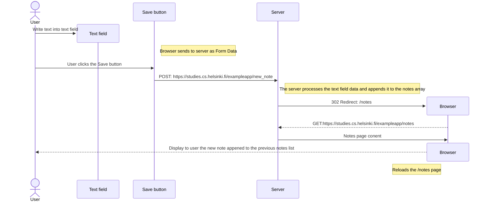

```mermaid
sequenceDiagram


    create actor User
    create participant Text field
    User->>Text field: Write text into text field

    Note right of Save button: Browser sends to server as Form Data
    User->>Save button: User clicks the Save button
    Save button->>Server: POST: https://studies.cs.helsinki.fi/exampleapp/new_note

    Note right of Server: The server processes the text field data and appends it to the notes array
    create participant Browser
    Server->>Browser: 302 Redirect: /notes
    Browser-->>Server: GET:https://studies.cs.helsinki.fi/exampleapp/notes
    Server->>Browser: Notes page conent
    destroy Browser
    Browser-->>User: Display to user the new note appened to the previous notes list
    Note left of Browser: Reloads the /notes page
```
