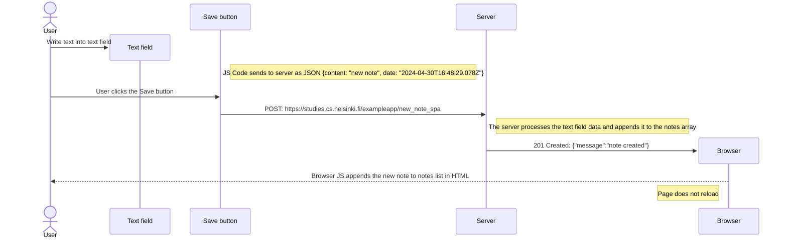

```mermaid
sequenceDiagram

create actor User
    create participant Text field
    User->>Text field: Write text into text field

    Note right of Save button: JS Code sends to server as JSON {content: "new note", date: "2024-04-30T16:48:29.078Z"}
    User->>Save button: User clicks the Save button
    Save button->>Server: POST: https://studies.cs.helsinki.fi/exampleapp/new_note_spa

    Note right of Server: The server processes the text field data and appends it to the notes array

    create participant Browser
    Server->>Browser: 201 Created: {"message":"note created"}
    Browser-->>User: Browser JS appends the new note to notes list in HTML

    Note left of Browser: Page does not reload
```
