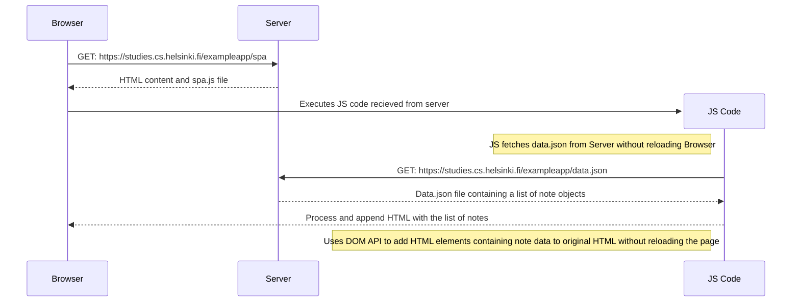

```mermaid
sequenceDiagram

participant Browser
participant Server

Browser->>Server: GET: https://studies.cs.helsinki.fi/exampleapp/spa
Server-->>Browser: HTML content and spa.js file
create participant JS Code
Browser->>JS Code: Executes JS code recieved from server

Note left of JS Code: JS fetches data.json from Server without reloading Browser
JS Code->>Server: GET: https://studies.cs.helsinki.fi/exampleapp/data.json
Server-->>JS Code: Data.json file containing a list of note objects
JS Code-->>Browser: Process and append HTML with the list of notes

Note left of JS Code: Uses DOM API to add HTML elements containing note data to original HTML without reloading the page
```
